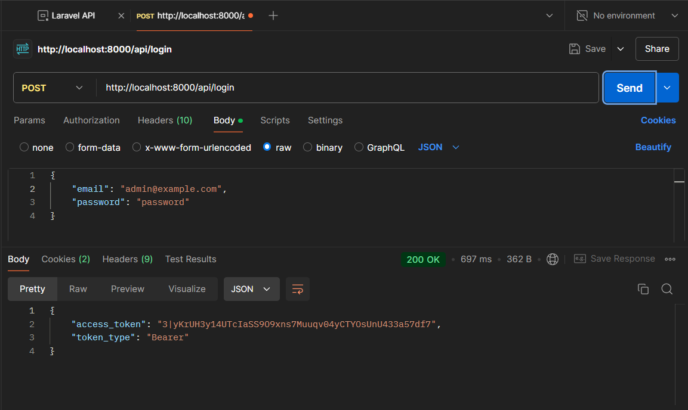
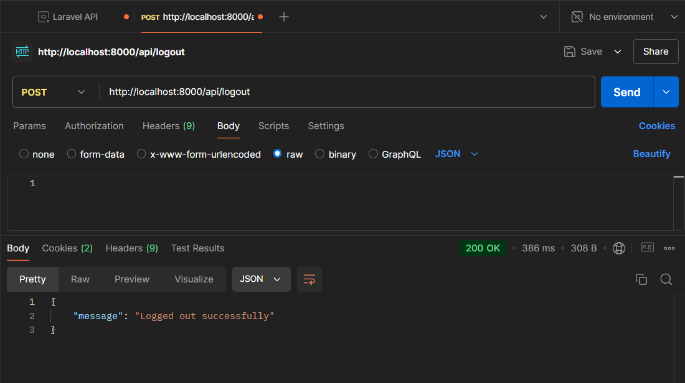
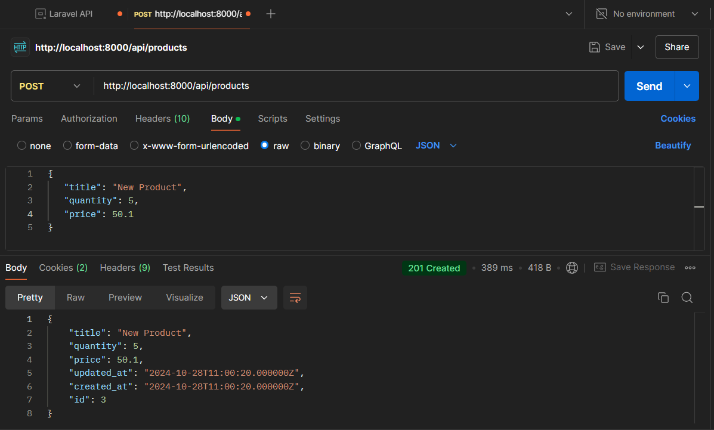
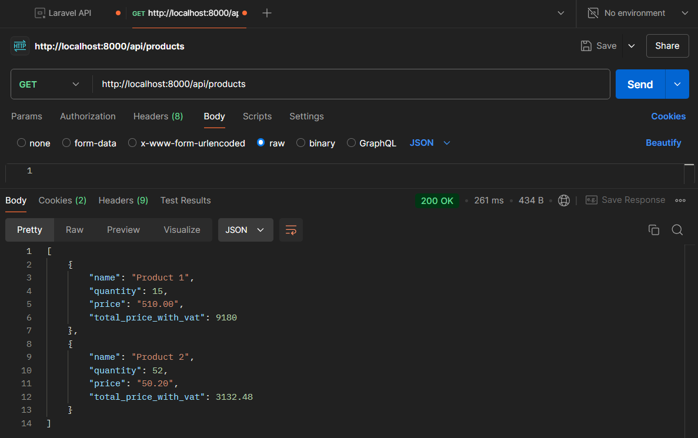
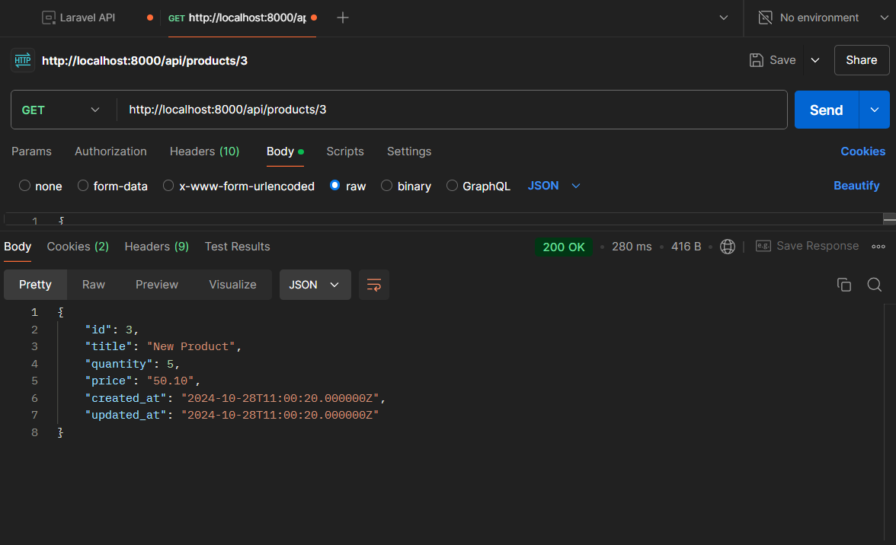
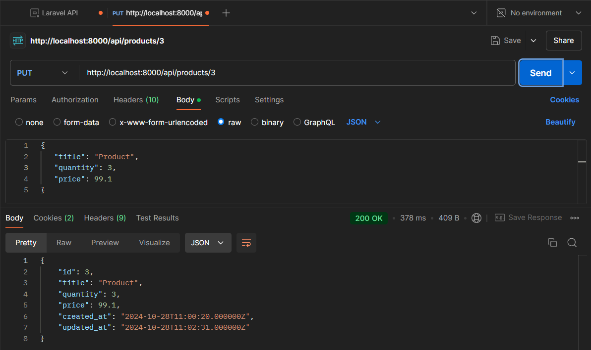
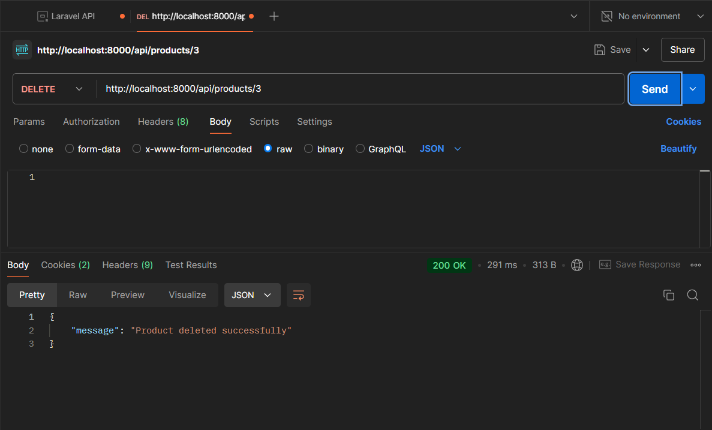
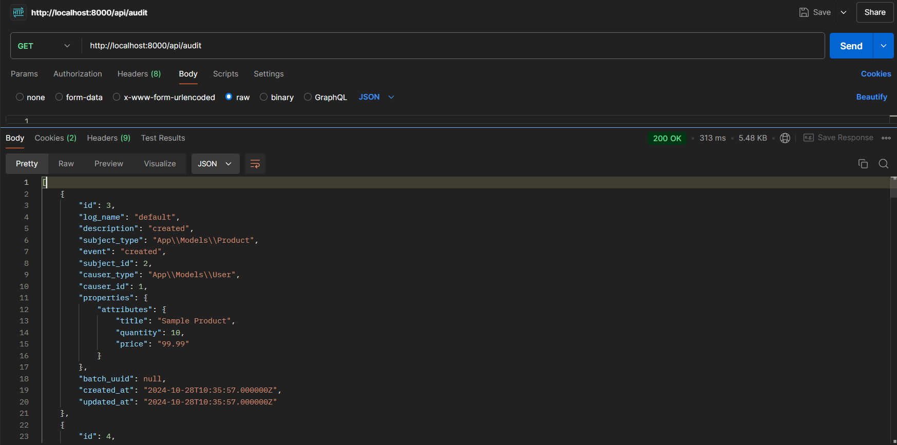

# Product API

## Description
A Laravel-based API for managing products with user authentication and audit logging.  

**Created for interview by Sardorjon Mirzakarimov**

## Requirements
- PHP >= 8.0
- Composer
- Laravel 10
- MySQL

## Installation

1. Clone the repository:
   ```bash
   git clone https://github.com/sardorkb/product-api.git

2. Change to project repository
cd product-api

3. Install dependencies
    -composer install

4. Copy the example environment file and update the environment variables
    -cp .env.example .env

5. Generate the application key
    -php artisan key:generate

6. Run migrations
    -php artisan migrate

## Seeding the Database
    -php artisan db:seed


## API Response Examples

### User Authentication



### Product Management

#### Create Product


#### Get All Products


#### Get Product by Id


#### Update Product


#### Delete Product


### Audit Logging

